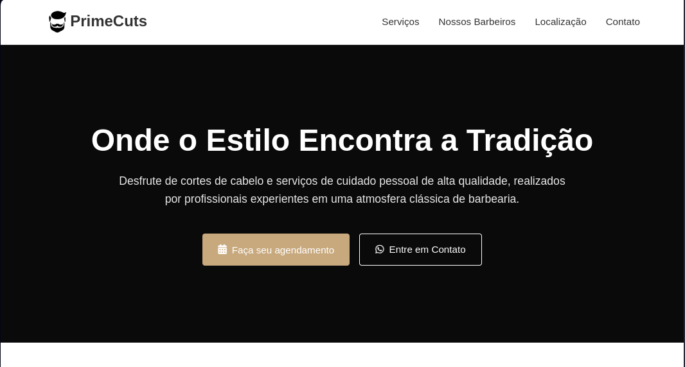

# 💈 PrimeCuts Barbearia

Projeto de estudo de front-end para uma barbearia fictícia chamado **PrimeCuts**, desenvolvido com HTML, CSS e JavaScript. A proposta é simular o site institucional de uma barbearia moderna e elegante, com funcionalidades básicas como agendamento de horários, apresentação de serviços, localização e contato.

## 📸 Preview



## 🖥️ Tecnologias Utilizadas

- **HTML5**: Estrutura da página
- **CSS3**: Estilização com responsividade e animações
- **JavaScript Vanilla**: Interatividade, como o menu mobile, modal de agendamento e rolagem suave
- **Font Awesome**: Ícones personalizados
- **Google Maps (simulado)**: Localização da barbearia

## 🚀 Funcionalidades

- Página inicial com apresentação da barbearia
- Lista de serviços com preços
- Modal para agendamento de horários
- Seção de localização e contato
- Menu responsivo com navegação suave
- Animações leves ao rolar a página

## 📁 Estrutura de Arquivos

```
📦 PrimeCuts
├── index.html         # Página principal do projeto
├── style.css          # Estilos customizados
├── script.js          # Scripts de interatividade
└── src/
    └── hairstyle.png  # Ícone/logo da barbearia
```

## 🤖 Feito com Apoio de Inteligência Artificial

Este projeto foi desenvolvido com o auxílio do ChatGPT, da OpenAI, como ferramenta de apoio para aprendizado, geração de código e revisão de boas práticas.

## 📚 Objetivo

Este projeto tem fins exclusivamente **educacionais**, servindo como exercício de aprendizagem de desenvolvimento web (HTML, CSS e JavaScript).

## 📝 Licença

Este projeto está sob a licença MIT. Sinta-se livre para usar e modificar!

---

**Autor**: Omisael Rocha  
**GitHub**: [https://github.com/omisaelrocha](https://github.com/omisaelrocha)